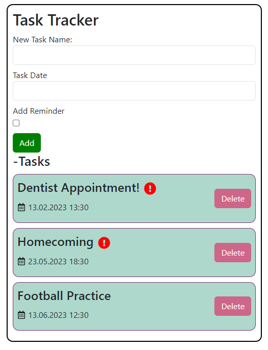

# React To-Do App

The React To-Do App is a simple web application that allows users to create, manage, and organize their to-do lists. This project is built using React, a popular JavaScript library for building user interfaces.

## Features

- Add new tasks to the to-do list.
- Mark tasks as completed or uncompleted.
- Remove tasks from the to-do list.
- Filter tasks by their completion status (all, completed, or active).
- Clear all completed tasks at once.

## Installation

1. Clone the repository: `git clone https://github.com/your-username/react-todo-app.git`
2. Navigate to the project directory: `cd react-todo-app`
3. Install the required dependencies: `npm install`

## Usage

1. Start the development server: `npm start`
2. Open your web browser and go to: `http://localhost:3000`
3. Now you can use the app to manage your to-do list!

## Contributing

Contributions are welcome! If you'd like to contribute to this project, please follow these steps:

1. Fork the repository.
2. Create a new branch: `git checkout -b feature/your-feature-name`
3. Make your changes and commit them: `git commit -m "Add your feature"`
4. Push the changes to your fork: `git push origin feature/your-feature-name`
5. Submit a pull request to the original repository.

## License

This project is licensed under the MIT License - see the [LICENSE](LICENSE) file for details.

## Acknowledgments

Thanks to the creators of React and other open-source libraries used in this project.

## Contact

If you have any questions, suggestions, or feedback, feel free to contact the project maintainers:

- Maintainer Name: Mithat Can Turan
- Maintainer Email: benmithat18@gmail.com

We hope you find this React To-Do App useful and enjoy using it to stay organized!
